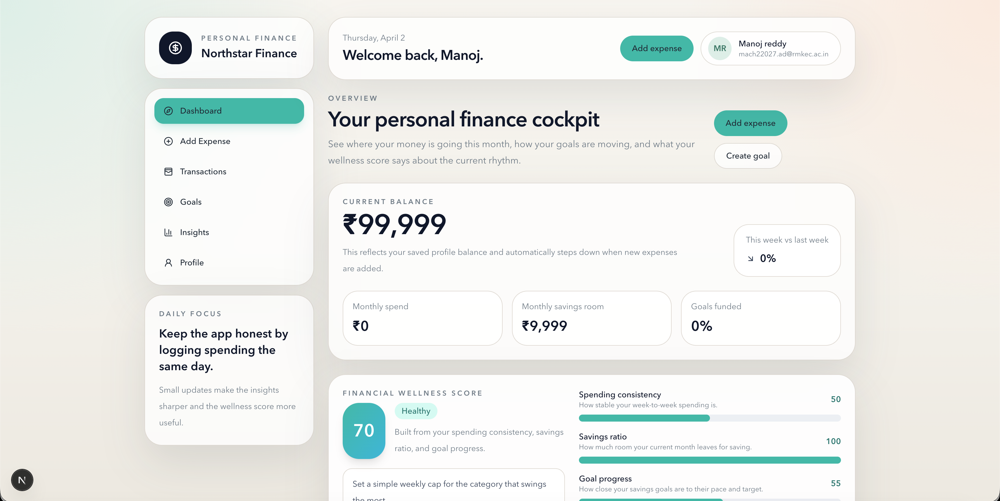
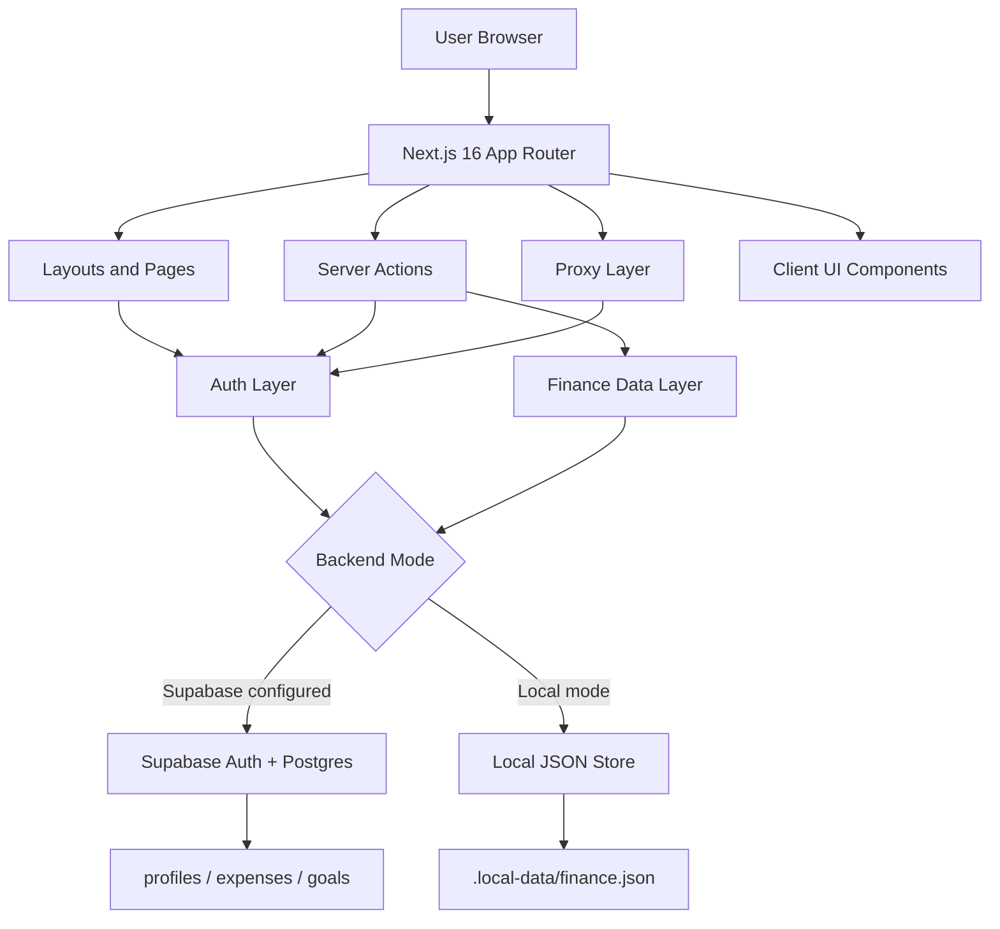
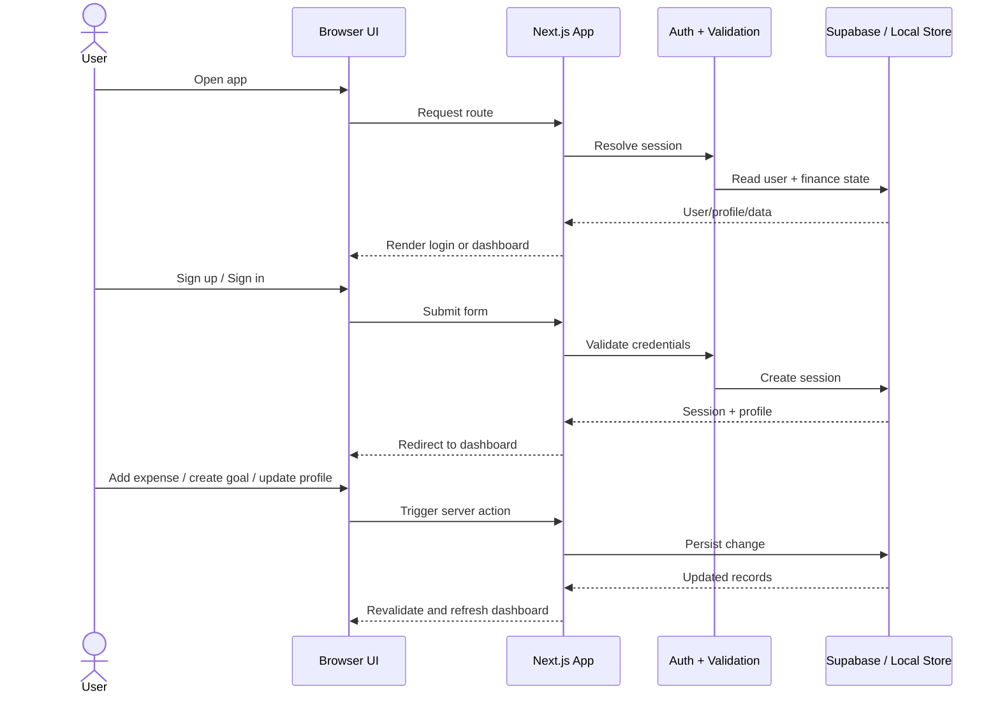

# Northstar Finance

Production-style personal finance web app for young professionals, built with Next.js 16, React 19, and Tailwind CSS 4. It supports both real Supabase-backed flows and a local machine-only mode for easy demos.


## Project Snapshot



## Features

- Email/password sign-up and sign-in
- Dashboard with balance, monthly spending, savings room, and wellness score
- Expense tracking with notes, category filters, and transaction history
- Savings goals with contribution updates and progress tracking
- Plain-language financial insights and visual charts
- Dual backend support: Supabase mode or local JSON storage mode

## Architecture



## Workflow



## Tech Stack

- Next.js 16
- React 19
- TypeScript
- Tailwind CSS 4
- Supabase SSR + Supabase Auth
- Recharts
- Zod

## App Routes

- `/`
- `/add-expense`
- `/transactions`
- `/goals`
- `/insights`
- `/profile`
- `/login`
- `/sign-up`

## Local Setup

1. Install dependencies.

```bash
npm install
```

2. Copy the example environment file.

```bash
cp .env.example .env.local
```

3. Add your Supabase URL and anon key to `.env.local`.

4. Open Supabase SQL Editor and run [`supabase/schema.sql`](./supabase/schema.sql).

5. Start the app.

```bash
npm run dev
```

6. Visit [http://localhost:3000](http://localhost:3000).

## Local Mode

If `.env.local` is missing, the app falls back to local machine-only mode:

- sign-up and sign-in still work
- finance data is stored in `.local-data/finance.json`
- Supabase remains the primary backend when credentials are configured

## Database Schema

The SQL setup creates:

- `profiles`
- `expenses`
- `goals`

It also includes:

- a new-user profile trigger
- row-level security policies
- an RPC to add expenses and update balance atomically
- an RPC to increment goal progress atomically

## Scripts

```bash
npm run dev
npm run lint
npm run typecheck
npm run build
```

## Node Version

Node 20 or Node 22 is recommended. The current dependency set may emit engine warnings on Node 23 even though the app still installs.

## Profiles

- GitHub: [MacharlaNagamanojreddy](https://github.com/MacharlaNagamanojreddy)
- LinkedIn: [Manoj Reddy Macharla](https://www.linkedin.com/in/manoj-reddy-macharla-8a9888258/)
